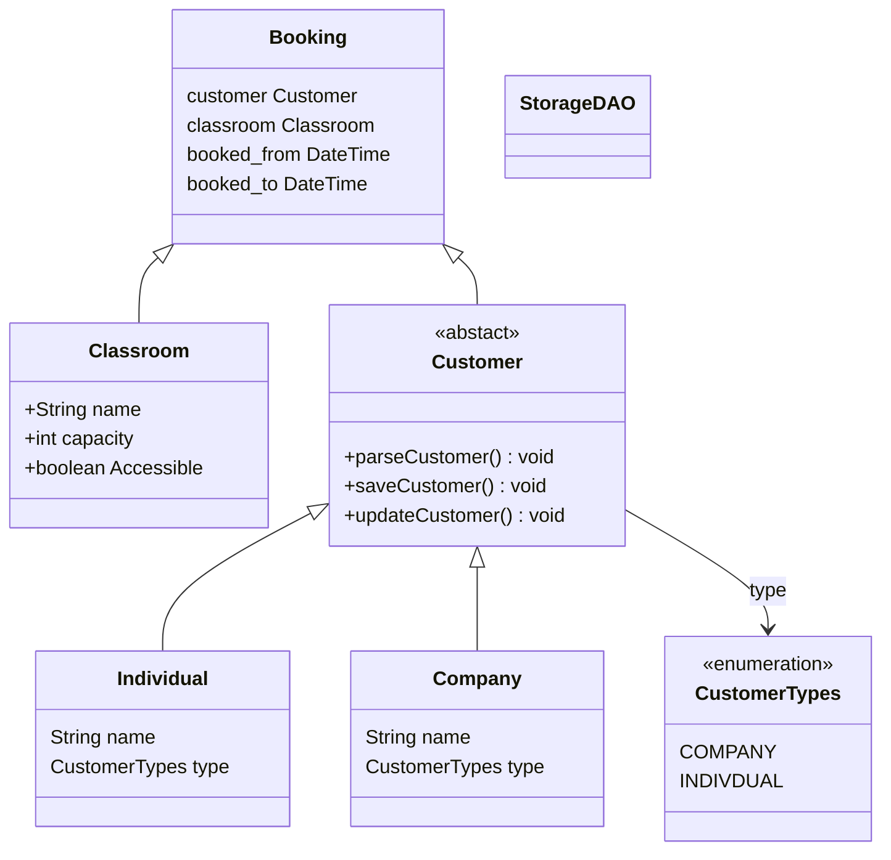

# Classroom rental-project
This project was the show the skills aquired so far. I admit that I 
did not plan properly doing the ClassDiagram. 
The diagram below does not show how the Storage is being used.
It does not show my different layers either, this will
be updated soon.

## 
## ClassDiagram:


Database Schema:
```mermaid
erDiagram
customers {
INT id PK
VARCHAR_45 name
VARCHAR_45 email
ENUM type
}

    classroom {
        INT id PK
        VARCHAR_45 name
        TEXT capacity
        ENUM accessibility
        TEXT equipment
    }

    bookings {
        INT id PK
        INT booked_by FK
        INT booked_classroom FK
        TIMESTAMP book_start
        TIMESTMAP book_end
    }

    customers ||--o{ bookings : "booked_by"
    classroom ||--o{ bookings : "booked_classroom"