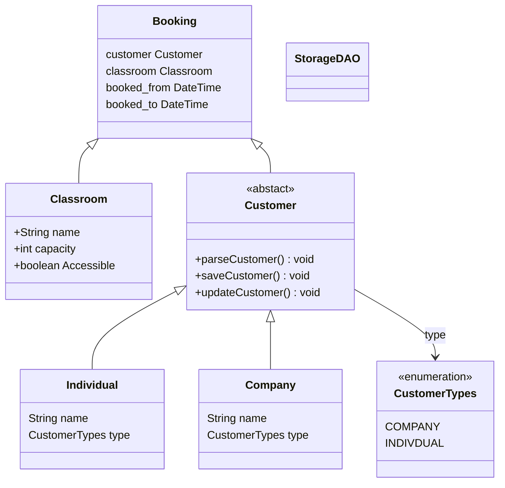

# TODO
* Create a class-diagram
* Create a database-diagram

## ClassDiagram:


Database Schema:
```mermaid
erDiagram
customers {
INT id PK
VARCHAR_45 name
ENUM type
}

    classroom {
        INT id PK
        VARCHAR_45 name
        TEXT capacity
        TEXT accessibility
    }

    bookings {
        INT id PK
        INT booked_by FK
        INT booked_classroom FK
        DATETIME book_start
        DATETIME book_end
    }

    customers ||--o{ bookings : "booked_by"
    classroom ||--o{ bookings : "booked_classroom"